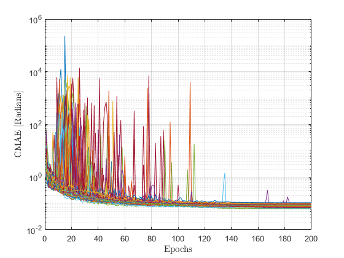

# Deep Neural Network Codebook Approach for Near-Field Nulling Control Beam Focusing

Implementation and results for the paper:  

**A Deep Neural Network Codebook Approach for Near-Field Nulling Control Beam Focusing**  
*Mohammadhossein Karimi, Yuanzhe Gong, Tho Le-Ngoc*  
Department of Electrical and Computer Engineering, McGill University, Montreal, QC, Canada  

---

## 📖 Abstract

This project introduces a **Deep Neural Network (DNN) Codebook** approach to mitigate **multi-user interference (MUI)** in **extremely large MIMO (XL-MIMO)** systems operating in the **near-field**.  

By partitioning the Fresnel region and training lightweight fully connected DNNs on LCMV-generated beamforming weights, the framework achieves **nulling control beam focusing (NCBF)** efficiently.  

Key results show **phase error ≈ 0.085 radians**, **magnitude error ≈ 0.52 dB**, and **interference suppression > 31.6 dB**, validated in **Ansys HFSS full-wave simulations**.  

---

## 🧩 Contributions

- **Scalable Codebook Design:** A library of compact DNNs specialized for subsections of the Fresnel region.  
- **Correlation-Based Sampling:** Efficient partitioning based on channel correlation instead of uniform sampling.  
- **Dual-Estimator Networks:** Separate phase and magnitude predictors improve stability and accuracy.  
- **Full-Wave Validation:** Performance confirmed using Ansys HFSS with realistic antenna arrays.  
- **High Accuracy:** Interference suppression within **2 dB of LCMV** while drastically reducing complexity.  

---

## ⚙️ Installation

Clone this repository and install dependencies:

```bash
git clone https://github.com/mhosseinkarimi/DNN_NF_NCB.git
cd DNN_NF_NCB
pip install -r requirements.txt
```

---

## 🚀 Usage

### Train the models 
```bash
python ./run.py
```

### Run inference for user locations
```bash
python ./test_cases.py
```

### Validate with Ansys HFSS
Predicted weights can be exported and applied to the HFSS patch-array antenna model for full-wave evaluation.  

---

## 📊 Results and Figures

### Partitioning of Near-Field Region
<p align="center">
  
</p>
*Fig. 1. Partitioning of the near-field region using correlation-based sampling.*  

➡️ The Fresnel region is divided into **75 subsections**, each assigned two DNNs (phase & magnitude). This ensures efficiency across distances and angles.  

---

### Codebook Structure
<p align="center">
  
</p>
*Fig. 2. Structure of the DNN codebook for MUI suppression.*  

➡️ User coordinates are processed, and the corresponding DNN model predicts beamforming weights. Compact per-region models reduce complexity while maintaining accuracy.  

---

### Training Loss Convergence
<p align="center">
  
  
</p>

*Fig. 3. Magnitude estimation training and testing loss curves for all subsections.*  

<p align="center">
  
  
</p>

*Fig. 4. Phase estimation training and testing loss curves for all subsections.* 
➡️ Stable convergence is observed after ~100 epochs. Final errors:  
- **Phase:** 0.085 rad  
- **Magnitude:** 0.52 dB  

---

### Error Distribution Across Subsections
<p align="center">
  
  
</p>

*Fig. 5. Error distribution across subsections.*  

➡️ Errors are tightly clustered, confirming robust and uniform performance across the entire Fresnel region.  

---

### Full-Wave Simulation Validation
<p align="center">
  
</p>

*Fig. 6 Radiation patterns from Ansys HFSS simulations.*  

➡️ **Scenario 1 (non-collinear users):** DNN results nearly overlap with LCMV, with nulls > 31.6 dB.  
➡️ **Scenario 2 (collinear users):** DNN achieves strong suppression (32–36 dB), within 2 dB of LCMV.  

---

## 📚 Citation

If you use this work, please cite:

```bibtex
@article{Karimi2025DNN,
  title   = {A Deep Neural Network Codebook Approach for Near-Field Nulling Control Beam Focusing},
  author  = {Mohammadhossein Karimi and Yuanzhe Gong and Tho Le-Ngoc},
  year    = {2025}
}
```

---

## 📜 License & Contact

This project is released under the [MIT License](./LICENSE).

For questions or collaboration:  
📧 mohammad.karimirozveh@mail.mcgill.ca  
